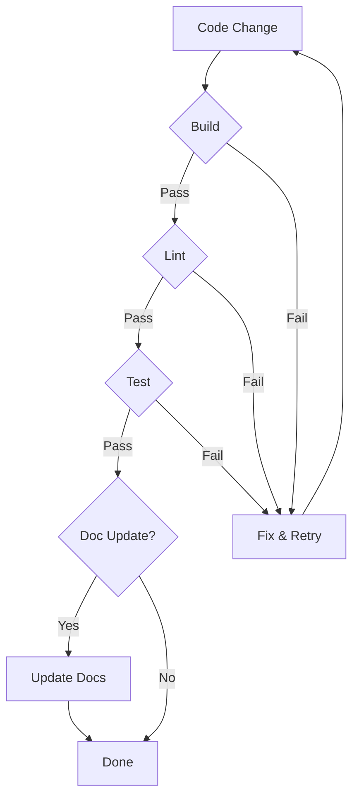

# Rule: Robust Loop

All implementation tasks MUST follow the Robust Loop to ensure the repository remains in a working state.

## Specification

After any code modification, the agent MUST perform the following cycle:

1.  **Build**: Run `yarn build` to ensure the code compiles correctly.
2.  **Lint**: Run `yarn lint` to verify adherence to coding standards.
3.  **Test**: Run `yarn test` (or specific tests related to the change) to ensure no regressions.
4.  **Doc Update**: Check if the change requires updating READMEs, comments, or specifications. If so, update them.

## Flow

## Failure Handling
If any step in the loop fails, the agent MUST:
1.  Analyze the error.
2.  Apply a fix.
3.  Restart the loop from the **Build** step.
