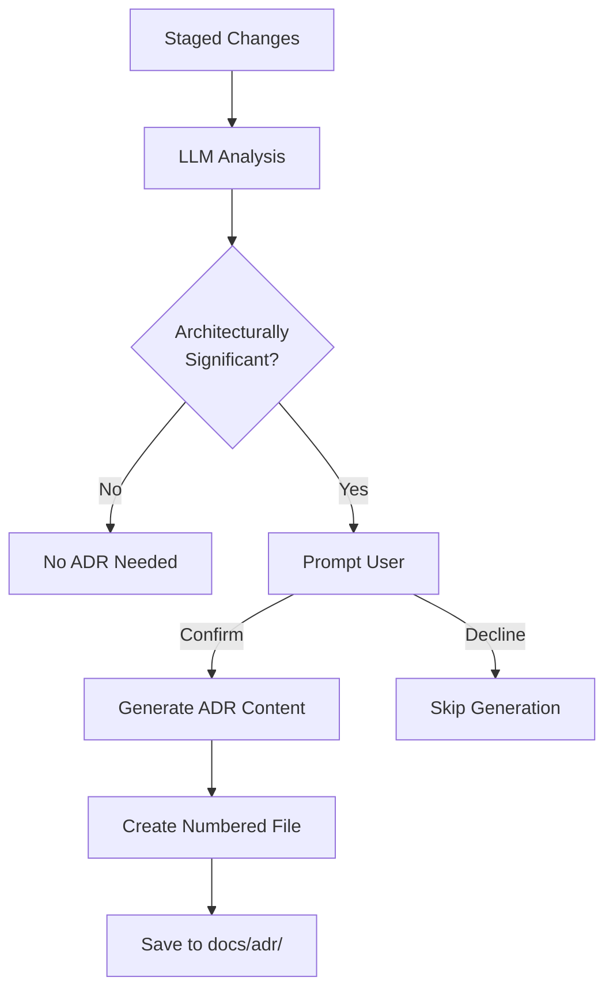

# ADR Generation

Learn how cADR automatically generates Architectural Decision Records (ADRs).

## Overview

When cADR detects an architecturally significant change, it offers to automatically generate a comprehensive ADR document using the same LLM that performed the analysis.

## How It Works

### Process

1. **Analysis**: cADR analyzes your staged changes and determines if they're architecturally significant
2. **User Confirmation**: You're prompted to confirm ADR generation
3. **Content Generation**: The LLM generates comprehensive ADR content based on your code changes
4. **File Creation**: ADR is saved with sequential numbering
5. **Review**: You review and refine the generated content

## User Confirmation Flow

When an architecturally significant change is detected, you'll be prompted to confirm ADR generation. Accept to proceed or decline to skip.

## What the LLM Analyzes

When generating an ADR, the LLM considers:

### Code Changes

- Diff of all staged files
- New patterns and abstractions
- Architectural implications
- Technology choices

### Context

- Existing codebase patterns (when available)
- Project configuration
- Dependencies and frameworks
- File organization

### Decision Factors

- Why this approach was chosen
- Alternative approaches considered
- Trade-offs made
- Impact on the system

## Generated ADR Structure

ADRs follow the [MADR (Markdown Architectural Decision Records)](https://adr.github.io/madr/) template format.

### File Naming

Format: `docs/adr/NNNN-descriptive-title.md`

- **NNNN**: Sequential number (0001, 0002, 0003...)
- **descriptive-title**: Kebab-case title derived from the decision
- **Auto-created**: Directory created if it doesn't exist

### ADR Content Sections

Each generated ADR includes:

1. **Title** - Clear, concise description of the decision
2. **Metadata** - Status and date of the decision
3. **Context and Problem Statement** - Why a decision was needed
4. **Decision Drivers** - Key factors that influenced the decision
5. **Considered Options** - Alternative approaches evaluated
6. **Decision Outcome** - The chosen approach and rationale
7. **Consequences** - Both positive and negative impacts

See [MADR_TEMPLATE.md](./MADR_TEMPLATE.md) for complete template details.

## Customization and Review

### Always Review Generated Content

While the LLM generates comprehensive ADRs, **always review and refine** the content:

1. **Verify accuracy**: Ensure the reasoning matches your actual decision
2. **Add context**: Include project-specific considerations
3. **Update drivers**: Add any decision factors the LLM might have missed
4. **Refine language**: Adjust tone and terminology for your team
5. **Add links**: Include references to relevant documentation or tickets

### Common Refinements

- Add links to related ADRs
- Include performance benchmarks
- Reference specific tickets or PRs
- Add code examples
- Clarify team-specific terminology
- Update consequences based on actual experience

## Sequential Numbering

cADR automatically determines the next sequential number by scanning the ADR directory and incrementing from the highest existing number.

## Best Practices

### 1. Generate ADRs Immediately

Create ADRs when the decision is fresh in your mind and the context is clear.

### 2. One ADR Per Decision

Focus each ADR on a single architectural decision. If multiple decisions are made, generate separate ADRs.

### 3. Commit ADRs with Code

Include the ADR in the same commit as the code changes it documents.

### 4. Review Before Committing

Always review generated ADRs before committing to ensure accuracy and completeness.

### 5. Update ADRs When Needed

If a decision changes or you learn new information, update the ADR or create a new one superseding it.

## Configuration

ADR generation uses the same model configured for analysis. Models with larger context windows can generate more comprehensive ADRs by analyzing larger diffs.

## Troubleshooting

### ADR Generation Times Out

Increase timeout in configuration.

### Generated ADR is Incomplete

**Possible causes:**
- Large diff exceeded context window
- Timeout occurred during generation

**Solutions:**
- Use a model with larger context window
- Increase timeout
- Break large changes into smaller, focused commits

### ADR Numbering Skipped a Number

This is normal when ADRs are created or deleted manually. Sequential numbering continues from the highest existing number.

## FAQ

### Can I edit generated ADRs?

**Yes!** Generated ADRs are starting points. Always review and refine them before committing.

### What if the LLM gets it wrong?

Simply edit the generated ADR to correct any inaccuracies. The LLM provides a helpful starting point, but you have final say.

### Can I skip ADR generation?

**Yes.** When prompted, decline to skip. You can always create an ADR manually later.

### Can I generate multiple ADRs from one analysis?

No. Each analysis generates at most one ADR. If you have multiple decisions, make separate commits and run separate analyses.

### Where are ADRs stored?

By default in `docs/adr/`. This follows the standard ADR convention and keeps documentation organized.

## Related Documentation

- [MADR Template Format](./MADR_TEMPLATE.md) - Complete ADR template
- [Usage Guide](./USAGE.md) - Command reference
- [Quick Start](./QUICK_START.md) - Getting started

## Resources

- [MADR Project](https://adr.github.io/madr/) - Official MADR specification
- [ADR GitHub Organization](https://adr.github.io/) - ADR tools and resources
- [Documenting Architecture Decisions](https://cognitect.com/blog/2011/11/15/documenting-architecture-decisions) - Original ADR concept

