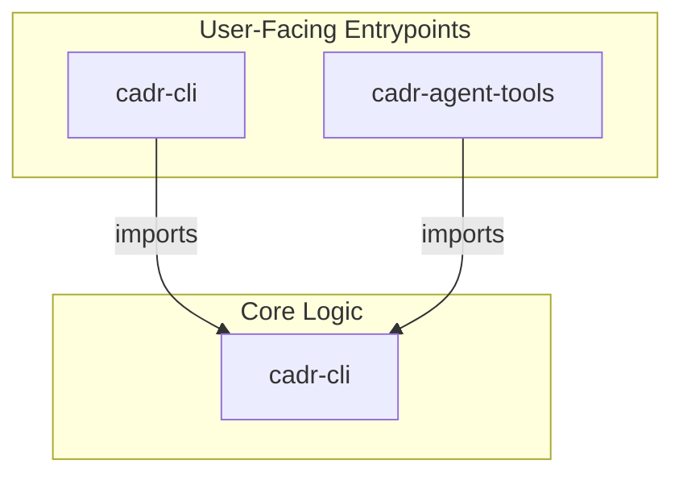

## **Technical Specification: cADR (Final)**

### **1. High-Level Architecture**

The project will be a TypeScript monorepo managed with `npm` workspaces.



* **`cadr-cli`:** A self-contained CLI package containing all business logic.
  * `src/git.ts`: Functions for interacting with the git CLI.
* `src/llm.ts`: Provider-based LLM client orchestrator for analysis.
* `src/providers/*`: Pluggable provider implementations (`openai`, `gemini`).
  * `src/prompts.ts`: Version-controlled prompt templates.
  * `src/adr.ts`: Logic for creating ADR files.
  * **Key Exports:** `analyze(diff): Promise<AnalysisResult>`, `generate(diff): Promise<string>`
* **`cadr-agent-tools`:** The GitHub Agent "head". Exposes `cadr-cli` functions as tools consumable by `gh-aw`.

### **2. API Contracts (Prompts)**

* **Analysis Prompt (`v1`):**

  * **System Prompt:** "You are an expert software architect acting as a code reviewer. Your task is to determine if a given `git diff` represents an architecturally significant change. Respond ONLY with a single, minified JSON object and nothing else. The JSON schema is: `{\"is_significant\": boolean, \"reason\": string}`. A change is significant if it introduces a new dependency, a new piece of infrastructure, a new API endpoint, or changes a core data model."
  * **User Prompt:** "Analyze the following git diff: \\n\\n `diff\n[git_diff_content]\n`"

* **Generation Prompt (`v1`):**

  * **System Prompt:** "You are an expert software architect. Your task is to write a concise and clear Architectural Decision Record (ADR) based on the provided `git diff`. The ADR must follow standard markdown format and include sections for 'Context', 'Decision', and 'Consequences'."
  * **User Prompt:** "Write an ADR for the following git diff: \\n\\n `diff\n[git_diff_content]\n`"

### **3. Observability**

* **Log Schema:** All structured logs MUST adhere to the following JSON schema:

    ```json
    {
      "timestamp": "2025-10-05T18:30:00.000Z",
      "level": "info",
      "message": "A human-readable message.",
      "context": {
        "git_repo": "github.com/org/repo",
        "duration_ms": 150,
        "llm_provider": "anthropic",
        "llm_model": "claude-3-haiku-20240307",
        "is_significant": true
      }
    }
    ```

* **Key Log Events:** `analysis.start`, `analysis.success`, `analysis.failure`, `generation.start`, `generation.success`, `generation.failure`, `adr.file_created`.

### **4. CI/CD & Open Source Strategy**

* **CI Workflow (`.github/workflows/test.yml`):**

    ```yaml
    name: Test
    on: [push, pull_request]
    jobs:
      test:
        runs-on: ubuntu-latest
        steps:
          - uses: actions/checkout@v4
          - uses: actions/setup-node@v4
            with:
              node-version: 20
              cache: 'npm'
          - run: npm install
          - run: npm run lint
          - run: npm test -- --coverage
    ```

* **Release Workflow (`.github/workflows/release.yml`):**

    ```yaml
    name: Release
    on:
      push:
        tags:
          - 'v*'
    jobs:
      release:
        runs-on: ubuntu-latest
        steps:
          - uses: actions/checkout@v4
          - uses: actions/setup-node@v4
            with:
              node-version: 20
              registry-url: 'https://registry.npmjs.org'
          - run: npm install
          - run: npm run build
          - run: npm publish --workspaces --access public
            env:
              NODE_AUTH_TOKEN: ${{ secrets.NPM_TOKEN }}
          - name: Create GitHub Release
            uses: softprops/action-gh-release@v1
            with:
              generate_release_notes: true
    ```
