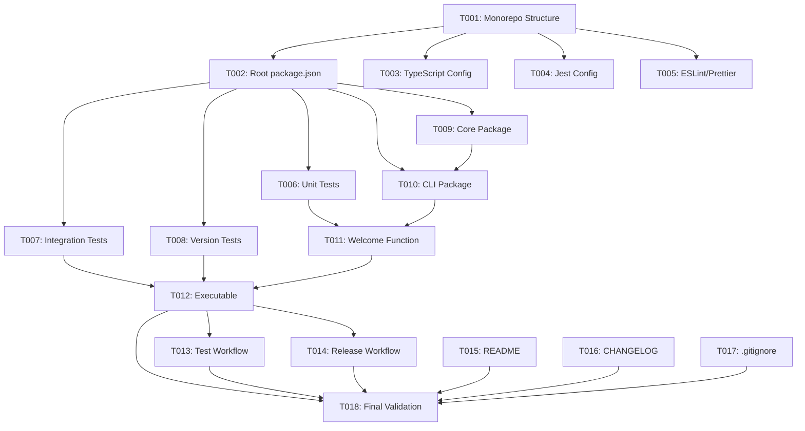

# Tasks: Hello World - Deployable NPM Package

**Feature Branch**: `001-hello-world-a`  
**Input**: Design documents from `/specs/001-hello-world-a/`  
**Prerequisites**: ✅ plan.md, ✅ research.md, ✅ quickstart.md, ✅ contracts/ (empty)

## Execution Flow (main)
```
1. Load plan.md from feature directory
   → ✅ Loaded: TypeScript monorepo, npm workspaces, Jest testing
   → ✅ Tech stack: TypeScript 5.x, Node.js 20+, no external frameworks
   → ✅ Structure: packages/core and packages/cli
2. Load optional design documents
   → ✅ research.md: npm workspaces, tsc build, Jest, ESLint+Prettier
   → ⚠️  data-model.md: N/A (no data entities)
   → ⚠️  contracts/: Empty (no API contracts)
   → ✅ quickstart.md: Integration test scenarios extracted
3. Generate tasks by category
   → Setup: Monorepo init, TypeScript config, tooling
   → Tests: Unit tests for CLI output, integration tests for execution
   → Core: Minimal core package, CLI package with welcome message
   → Integration: N/A (no external integrations)
   → Polish: CI/CD workflows, documentation, package metadata
4. Apply task rules
   → Different files marked [P] for parallel execution
   → Tests before implementation (TDD compliance)
   → Dependencies documented
5. Number tasks sequentially (T001-T018)
6. Generate dependency graph
7. ✅ Tasks ready for execution
```

---

## Format: `[ID] [P?] Description`
- **[P]**: Can run in parallel (different files, no dependencies)
- File paths are absolute from repository root: `/Users/rbarabash/Workspace/cADR/cADR/`

---

## Phase 3.1: Setup & Foundation (Estimated: 1-2 hours)

### T001: Initialize Monorepo Structure
**Priority**: CRITICAL - Blocks all other tasks  
**Files**: Root directory structure

Create the foundational monorepo structure with npm workspaces:

```bash
# From /Users/rbarabash/Workspace/cADR/cADR/
mkdir -p packages/core/src
mkdir -p packages/cli/src
mkdir -p packages/cli/bin
mkdir -p tests/unit/cli
mkdir -p tests/integration
```

**Deliverables**:
- Directories created as shown
- Ready for package initialization

**DoD**:
- [ ] All directories exist
- [ ] No files created yet (structure only)

---

### T002: Create Root Package Configuration
**Priority**: CRITICAL - Required for workspace setup  
**Files**: `/Users/rbarabash/Workspace/cADR/cADR/package.json`

Create root package.json with workspace configuration:

```json
{
  "name": "cadr",
  "version": "0.0.1",
  "private": true,
  "workspaces": [
    "packages/*"
  ],
  "scripts": {
    "build": "tsc --build",
    "test": "jest",
    "test:coverage": "jest --coverage",
    "lint": "eslint . --ext .ts",
    "format": "prettier --write \"**/*.{ts,json,md}\"",
    "clean": "rm -rf packages/*/dist"
  },
  "devDependencies": {
    "@types/jest": "^29.5.0",
    "@types/node": "^20.0.0",
    "@typescript-eslint/eslint-plugin": "^6.0.0",
    "@typescript-eslint/parser": "^6.0.0",
    "eslint": "^8.0.0",
    "eslint-config-prettier": "^9.0.0",
    "jest": "^29.5.0",
    "prettier": "^3.0.0",
    "ts-jest": "^29.1.0",
    "typescript": "^5.0.0"
  },
  "engines": {
    "node": ">=20.0.0"
  }
}
```

**DoD**:
- [ ] File created with above content
- [ ] All required devDependencies listed
- [ ] Workspace configuration correct

---

### T003: [P] Configure TypeScript (Root)
**Priority**: HIGH - Required for compilation  
**Files**: `/Users/rbarabash/Workspace/cADR/cADR/tsconfig.json`

Create shared TypeScript configuration with project references:

```json
{
  "compilerOptions": {
    "target": "ES2022",
    "module": "commonjs",
    "lib": ["ES2022"],
    "strict": true,
    "esModuleInterop": true,
    "skipLibCheck": true,
    "forceConsistentCasingInFileNames": true,
    "declaration": true,
    "declarationMap": true,
    "sourceMap": true,
    "composite": true,
    "outDir": "./dist",
    "rootDir": "./src"
  },
  "files": [],
  "references": [
    { "path": "./packages/core" },
    { "path": "./packages/cli" }
  ]
}
```

**DoD**:
- [ ] tsconfig.json created
- [ ] Strict mode enabled
- [ ] Project references configured

---

### T004: [P] Configure Jest
**Priority**: HIGH - Required for testing  
**Files**: `/Users/rbarabash/Workspace/cADR/cADR/jest.config.js`

Create Jest configuration with TypeScript support and coverage thresholds:

```javascript
module.exports = {
  preset: 'ts-jest',
  testEnvironment: 'node',
  roots: ['<rootDir>/packages', '<rootDir>/tests'],
  testMatch: ['**/__tests__/**/*.ts', '**/?(*.)+(spec|test).ts'],
  collectCoverageFrom: [
    'packages/*/src/**/*.ts',
    '!**/*.d.ts',
    '!**/node_modules/**'
  ],
  coverageThreshold: {
    global: {
      branches: 80,
      functions: 80,
      lines: 80,
      statements: 80
    }
  },
  coverageDirectory: 'coverage',
  verbose: true
};
```

**DoD**:
- [ ] jest.config.js created
- [ ] 80% coverage threshold set
- [ ] ts-jest preset configured

---

### T005: [P] Configure ESLint and Prettier
**Priority**: MEDIUM - Required for code quality gates  
**Files**: 
- `/Users/rbarabash/Workspace/cADR/cADR/.eslintrc.js`
- `/Users/rbarabash/Workspace/cADR/cADR/.prettierrc`

Create ESLint configuration enforcing Constitution principles:

**.eslintrc.js**:
```javascript
module.exports = {
  parser: '@typescript-eslint/parser',
  parserOptions: {
    ecmaVersion: 2022,
    sourceType: 'module',
    project: './tsconfig.json'
  },
  extends: [
    'eslint:recommended',
    'plugin:@typescript-eslint/recommended',
    'prettier'
  ],
  rules: {
    'no-console': 'error', // Enforce structured logging
    '@typescript-eslint/no-explicit-any': 'error',
    '@typescript-eslint/explicit-function-return-type': 'warn'
  }
};
```

**.prettierrc**:
```json
{
  "semi": true,
  "trailingComma": "es5",
  "singleQuote": true,
  "printWidth": 100,
  "tabWidth": 2
}
```

**DoD**:
- [ ] Both config files created
- [ ] ESLint rules enforce Constitution
- [ ] Prettier configured

---

## Phase 3.2: Tests First (TDD) ⚠️ MUST COMPLETE BEFORE 3.3
**CRITICAL: These tests MUST be written and MUST FAIL before ANY implementation**

### T006: [P] Unit Test - CLI Message Output
**Priority**: HIGH - TDD requirement  
**Files**: `/Users/rbarabash/Workspace/cADR/cADR/tests/unit/cli/message.test.ts`

Create unit test for welcome message content and format:

```typescript
import { getWelcomeMessage } from '../../../packages/cli/src/index';

describe('Welcome Message', () => {
  test('includes product name', () => {
    const message = getWelcomeMessage();
    expect(message).toMatch(/cADR/i);
  });

  test('includes version number', () => {
    const message = getWelcomeMessage();
    expect(message).toContain('0.0.1');
  });

  test('includes description', () => {
    const message = getWelcomeMessage();
    expect(message).toMatch(/architectural decision record/i);
  });

  test('is properly formatted with newlines', () => {
    const message = getWelcomeMessage();
    expect(message).toContain('\n');
    expect(message.length).toBeGreaterThan(50);
  });
});
```

**Expected**: ❌ Tests MUST fail (function doesn't exist yet)

**DoD**:
- [ ] Test file created
- [ ] All 4 tests written
- [ ] Tests fail when run (RED state)

---

### T007: [P] Integration Test - CLI Execution
**Priority**: HIGH - TDD requirement  
**Files**: `/Users/rbarabash/Workspace/cADR/cADR/tests/integration/cli-execution.test.ts`

Create integration test for CLI executable behavior:

```typescript
import { exec } from 'child_process';
import { promisify } from 'util';
import { resolve } from 'path';

const execAsync = promisify(exec);
const CLI_PATH = resolve(__dirname, '../../packages/cli/bin/cadr.js');

describe('CLI Execution', () => {
  test('displays welcome message when executed', async () => {
    const { stdout, stderr } = await execAsync(`node ${CLI_PATH}`);
    expect(stdout).toContain('Hello, cADR!');
    expect(stderr).toBe('');
  });

  test('exits with code 0 on success', async () => {
    const { stdout } = await execAsync(`node ${CLI_PATH}`);
    // If no error thrown, exit code was 0
    expect(stdout).toBeTruthy();
  });

  test('displays message within 2 seconds', async () => {
    const start = Date.now();
    await execAsync(`node ${CLI_PATH}`);
    const duration = Date.now() - start;
    expect(duration).toBeLessThan(2000);
  });

  test('works when executed from different directory', async () => {
    const { stdout } = await execAsync(`node ${CLI_PATH}`, { cwd: '/tmp' });
    expect(stdout).toContain('cADR');
  });
});
```

**Expected**: ❌ Tests MUST fail (CLI doesn't exist yet)

**DoD**:
- [ ] Test file created
- [ ] All 4 tests written
- [ ] Tests fail when run (RED state)

---

### T008: [P] Integration Test - Version Display
**Priority**: MEDIUM - Validates metadata  
**Files**: `/Users/rbarabash/Workspace/cADR/cADR/tests/integration/version.test.ts`

Create test for version consistency:

```typescript
import { exec } from 'child_process';
import { promisify } from 'util';
import { resolve } from 'path';
import { readFileSync } from 'fs';

const execAsync = promisify(exec);
const CLI_PATH = resolve(__dirname, '../../packages/cli/bin/cadr.js');
const PACKAGE_JSON = resolve(__dirname, '../../packages/cli/package.json');

describe('Version Display', () => {
  test('displayed version matches package.json', async () => {
    const { stdout } = await execAsync(`node ${CLI_PATH}`);
    const packageJson = JSON.parse(readFileSync(PACKAGE_JSON, 'utf-8'));
    
    expect(stdout).toContain(packageJson.version);
  });

  test('version format is semantic (X.Y.Z)', async () => {
    const { stdout } = await execAsync(`node ${CLI_PATH}`);
    expect(stdout).toMatch(/\d+\.\d+\.\d+/);
  });
});
```

**Expected**: ❌ Tests MUST fail

**DoD**:
- [ ] Test file created
- [ ] Tests written and failing

---

### ⚠️ CHECKPOINT: Verify Tests Fail
Before proceeding to Phase 3.3, run:
```bash
npm install
npm test
```
**Expected**: All tests fail (RED state) ✅ This is correct!

---

## Phase 3.3: Core Implementation (ONLY after tests are failing)

### T009: [P] Create @cadr/core Package
**Priority**: HIGH - Foundation package  
**Files**: 
- `/Users/rbarabash/Workspace/cADR/cADR/packages/core/package.json`
- `/Users/rbarabash/Workspace/cADR/cADR/packages/core/tsconfig.json`
- `/Users/rbarabash/Workspace/cADR/cADR/packages/core/src/index.ts`

Create core package structure (empty for now, placeholder for future):

**package.json**:
```json
{
  "name": "@cadr/core",
  "version": "0.0.1",
  "description": "Core business logic for cADR",
  "main": "dist/index.js",
  "types": "dist/index.d.ts",
  "scripts": {
    "build": "tsc",
    "test": "jest"
  },
  "keywords": ["adr", "architecture", "decision-records"],
  "author": "",
  "license": "MIT"
}
```

**tsconfig.json**:
```json
{
  "extends": "../../tsconfig.json",
  "compilerOptions": {
    "outDir": "./dist",
    "rootDir": "./src"
  },
  "include": ["src/**/*"]
}
```

**src/index.ts**:
```typescript
// Placeholder for future core business logic
// Future: git.ts, llm.ts, prompts.ts, adr.ts
export const CORE_VERSION = '0.0.1';
```

**DoD**:
- [ ] All 3 files created
- [ ] Package builds successfully
- [ ] Exports CORE_VERSION constant

---

### T010: Create cadr-cli Package Configuration
**Priority**: HIGH - CLI package foundation  
**Files**: 
- `/Users/rbarabash/Workspace/cADR/cADR/packages/cli/package.json`
- `/Users/rbarabash/Workspace/cADR/cADR/packages/cli/tsconfig.json`

**package.json**:
```json
{
  "name": "cadr-cli",
  "version": "0.0.1",
  "description": "Continuous Architectural Decision Records - Automatically capture ADRs as you code",
  "main": "dist/index.js",
  "bin": {
    "cadr": "./bin/cadr.js"
  },
  "scripts": {
    "build": "tsc",
    "test": "jest"
  },
  "keywords": ["adr", "architecture", "cli", "decision-records", "documentation"],
  "author": "",
  "license": "MIT",
  "repository": {
    "type": "git",
    "url": "https://github.com/[org]/cADR.git"
  },
  "engines": {
    "node": ">=20.0.0"
  },
  "dependencies": {
    "@cadr/core": "workspace:*"
  }
}
```

**tsconfig.json**:
```json
{
  "extends": "../../tsconfig.json",
  "compilerOptions": {
    "outDir": "./dist",
    "rootDir": "./src"
  },
  "include": ["src/**/*"],
  "references": [
    { "path": "../core" }
  ]
}
```

**DoD**:
- [ ] Both files created
- [ ] Bin entry points to ./bin/cadr.js
- [ ] Depends on @cadr/core via workspace protocol

---

### T011: Implement Welcome Message Function
**Priority**: HIGH - Core CLI functionality  
**Files**: `/Users/rbarabash/Workspace/cADR/cADR/packages/cli/src/index.ts`

Implement the welcome message display logic:

```typescript
import { CORE_VERSION } from '@cadr/core';

export function getWelcomeMessage(): string {
  const version = '0.0.1';
  
  return `🎉 Hello, cADR!

cADR (Continuous Architectural Decision Records) helps you automatically
capture and document architectural decisions as you code.

Version: ${version}
Core: ${CORE_VERSION}
Learn more: https://github.com/[org]/cADR

Get started by running 'cadr --help' (coming in future versions!)
`;
}

export function displayWelcome(): void {
  // Use process.stdout.write instead of console.log (Constitution: no console.log)
  process.stdout.write(getWelcomeMessage());
}

// Allow direct execution for testing
if (require.main === module) {
  displayWelcome();
  process.exit(0);
}
```

**DoD**:
- [ ] getWelcomeMessage() exported and testable
- [ ] displayWelcome() uses process.stdout.write (not console.log)
- [ ] Imports from @cadr/core
- [ ] Unit tests (T006) now PASS (GREEN state)

---

### T012: Create Executable Wrapper
**Priority**: HIGH - Makes CLI executable  
**Files**: `/Users/rbarabash/Workspace/cADR/cADR/packages/cli/bin/cadr.js`

Create Node.js shebang wrapper:

```javascript
#!/usr/bin/env node

// Executable wrapper for cadr-cli
// This file is the entry point when running 'cadr' command

require('../dist/index.js');
```

**Post-creation**:
```bash
chmod +x packages/cli/bin/cadr.js
```

**DoD**:
- [ ] File created with shebang
- [ ] Execute permission set
- [ ] Requires compiled dist/index.js
- [ ] Integration tests (T007, T008) now PASS (GREEN state)

---

### ✅ CHECKPOINT: Verify Tests Pass
Run tests again:
```bash
npm run build
npm test
```
**Expected**: All tests PASS (GREEN state) ✅

---

## Phase 3.4: CI/CD Automation

### T013: [P] Create Test Workflow
**Priority**: HIGH - CI automation  
**Files**: `/Users/rbarabash/Workspace/cADR/cADR/.github/workflows/test.yml`

Create GitHub Actions workflow for continuous testing:

```yaml
name: Test

on:
  push:
    branches: ['**']
  pull_request:
    branches: [master, main]

jobs:
  test:
    runs-on: ${{ matrix.os }}
    strategy:
      matrix:
        os: [ubuntu-latest, macos-latest, windows-latest]
        node-version: [20.x, 22.x]

    steps:
      - uses: actions/checkout@v4
      
      - name: Setup Node.js ${{ matrix.node-version }}
        uses: actions/setup-node@v4
        with:
          node-version: ${{ matrix.node-version }}
          cache: 'npm'
      
      - name: Install dependencies
        run: npm ci
      
      - name: Lint
        run: npm run lint
      
      - name: Build
        run: npm run build
      
      - name: Test
        run: npm test -- --coverage
      
      - name: Test package installation
        run: |
          npm pack --workspace=cadr-cli
          npm install -g ./cadr-cli-0.0.1.tgz
          cadr
        shell: bash
      
      - name: Upload coverage
        uses: codecov/codecov-action@v3
        if: matrix.os == 'ubuntu-latest' && matrix.node-version == '20.x'
        with:
          files: ./coverage/lcov.info
```

**DoD**:
- [ ] Workflow file created
- [ ] Tests on 3 OS platforms
- [ ] Tests Node.js 20 and 22
- [ ] Includes package installation test

---

### T014: [P] Create Release Workflow
**Priority**: HIGH - Automated publishing  
**Files**: `/Users/rbarabash/Workspace/cADR/cADR/.github/workflows/release.yml`

Create workflow for automated NPM publishing:

```yaml
name: Release

on:
  push:
    tags:
      - 'v*.*.*'

jobs:
  release:
    runs-on: ubuntu-latest
    permissions:
      contents: write
      id-token: write  # Required for npm provenance

    steps:
      - uses: actions/checkout@v4
      
      - name: Setup Node.js
        uses: actions/setup-node@v4
        with:
          node-version: '20.x'
          registry-url: 'https://registry.npmjs.org'
      
      - name: Install dependencies
        run: npm ci
      
      - name: Build
        run: npm run build
      
      - name: Run tests
        run: npm test
      
      - name: Publish to NPM
        run: npm publish --workspace=cadr-cli --provenance --access public
        env:
          NODE_AUTH_TOKEN: ${{ secrets.NPM_TOKEN }}
      
      - name: Create GitHub Release
        uses: softprops/action-gh-release@v1
        with:
          generate_release_notes: true
          files: |
            cadr-cli-*.tgz
```

**DoD**:
- [ ] Workflow created
- [ ] Triggered by version tags (v*.*.*)
- [ ] Includes npm provenance
- [ ] Creates GitHub release

---

## Phase 3.5: Polish & Documentation

### T015: [P] Create Comprehensive README
**Priority**: MEDIUM - Project documentation  
**Files**: `/Users/rbarabash/Workspace/cADR/cADR/README.md`

Create README with installation and usage instructions:

```markdown
# cADR - Continuous Architectural Decision Records

Automatically capture and document architectural decisions as you code.

## Features

- 🤖 AI-powered detection of significant code changes
- 📝 Automated ADR generation
- ⚡ Integrates with git workflow (pre-commit hook)
- 🔄 GitHub PR review integration
- 📦 Zero-config for quick start

## Installation

### Via npx (no install required)

```bash
npx cadr@latest
```

### Global installation

```bash
npm install -g cadr-cli
```

## Current Status

**Version 0.0.1** - Hello World release

This initial release validates the CI/CD pipeline and package distribution. 
Full ADR functionality coming in upcoming releases!

## Roadmap

- [x] v0.0.1: Package distribution and CI/CD
- [ ] v0.1.0: Git integration and file analysis
- [ ] v0.2.0: LLM-powered change detection
- [ ] v0.3.0: ADR generation
- [ ] v1.0.0: Full MVP with CLI and GitHub Agent

## Development

See [CONTRIBUTING.md](./CONTRIBUTING.md) for development setup.

## License

MIT
```

**DoD**:
- [ ] README created
- [ ] Installation instructions clear
- [ ] Current status documented
- [ ] Roadmap included

---

### T016: [P] Create CHANGELOG
**Priority**: MEDIUM - Release documentation  
**Files**: `/Users/rbarabash/Workspace/cADR/cADR/CHANGELOG.md`

Document release history:

```markdown
# Changelog

All notable changes to this project will be documented in this file.

The format is based on [Keep a Changelog](https://keepachangelog.com/en/1.0.0/),
and this project adheres to [Semantic Versioning](https://semver.org/spec/v2.0.0.html).

## [0.0.1] - 2025-10-05

### Added
- Initial project structure with npm workspaces monorepo
- @cadr/core package (placeholder for future business logic)
- cadr-cli package with welcome message display
- TypeScript build configuration with project references
- Jest test framework with 80% coverage threshold
- ESLint and Prettier for code quality
- GitHub Actions CI workflow (test on multiple platforms)
- GitHub Actions release workflow (automated npm publishing)
- Cross-platform executable support (Windows, macOS, Linux)

### Infrastructure
- npm workspaces monorepo setup
- TypeScript 5.x with strict mode
- Node.js 20+ requirement
- Automated releases via git tags

## [Unreleased]

### Planned for 0.1.0
- Git integration for reading staged files
- Structured logging module
- Configuration file support

[0.0.1]: https://github.com/[org]/cADR/releases/tag/v0.0.1
```

**DoD**:
- [ ] CHANGELOG created
- [ ] v0.0.1 changes documented
- [ ] Follows Keep a Changelog format

---

### T017: Update .gitignore
**Priority**: LOW - Code hygiene  
**Files**: `/Users/rbarabash/Workspace/cADR/cADR/.gitignore`

Ensure proper files are ignored:

```
# Dependencies
node_modules/
package-lock.json

# Build outputs
dist/
*.tgz

# Test coverage
coverage/
*.lcov

# IDE
.vscode/
.idea/
*.swp
*.swo
.DS_Store

# Environment
.env
.env.local

# Logs
*.log
npm-debug.log*
```

**DoD**:
- [ ] .gitignore created or updated
- [ ] All build artifacts ignored
- [ ] IDE files ignored

---

### T018: Final Validation & Cleanup
**Priority**: HIGH - Pre-release check  
**Files**: Multiple

Final checklist before tagging v0.0.1:

1. **Build & Test**:
   ```bash
   npm run clean
   npm install
   npm run build
   npm test
   npm run lint
   ```

2. **Local Package Test**:
   ```bash
   npm pack --workspace=cadr-cli
   npm install -g ./cadr-cli-0.0.1.tgz
   cadr  # Should display welcome message
   echo $?  # Should output 0
   ```

3. **Cross-reference Documentation**:
   - [ ] README installation instructions accurate
   - [ ] CHANGELOG reflects all changes
   - [ ] package.json metadata complete
   - [ ] Repository URL correct

4. **Verify quickstart.md scenarios**:
   - [ ] All acceptance criteria pass
   - [ ] Performance < 2 seconds

5. **Clean up**:
   - [ ] Remove any debug code
   - [ ] Remove any TODO comments
   - [ ] Verify no console.log statements

**DoD**:
- [ ] All tests pass
- [ ] Coverage ≥ 80%
- [ ] Linting passes with no errors
- [ ] Package installs and executes correctly
- [ ] All documentation accurate
- [ ] Ready for git tag v0.0.1

---

## Dependencies Graph



---

## Parallel Execution Examples

### Setup Phase (can run together)
```bash
# After T001 and T002 complete, run in parallel:
Task: "[T003] Configure TypeScript"
Task: "[T004] Configure Jest"  
Task: "[T005] Configure ESLint and Prettier"
```

### Test Phase (can run together after setup)
```bash
# TDD: Write all tests in parallel
Task: "[T006] Unit Test - CLI Message Output"
Task: "[T007] Integration Test - CLI Execution"
Task: "[T008] Integration Test - Version Display"
```

### Implementation Phase (some parallel)
```bash
# Core and CLI package configs can be parallel
Task: "[T009] Create @cadr/core Package"
Task: "[T010] Create cadr-cli Package Configuration"

# But T011 requires T009 and T010 to complete first
# T012 requires T011 to complete
```

### CI/CD Phase (can run together)
```bash
Task: "[T013] Create Test Workflow"
Task: "[T014] Create Release Workflow"
```

### Documentation Phase (can run together)
```bash
Task: "[T015] Create Comprehensive README"
Task: "[T016] Create CHANGELOG"
Task: "[T017] Update .gitignore"
```

---

## Validation Checklist
*GATE: Must pass before considering feature complete*

- [x] All contracts have corresponding tests - N/A (no contracts)
- [x] All entities have model tasks - N/A (no entities)
- [x] All tests come before implementation - ✅ T006-T008 before T009-T012
- [x] Parallel tasks truly independent - ✅ Verified
- [x] Each task specifies exact file path - ✅ All paths absolute
- [x] No task modifies same file as another [P] task - ✅ Verified

---

## Estimated Timeline

| Phase | Tasks | Estimated Time | Can Parallelize |
|-------|-------|----------------|-----------------|
| 3.1 Setup | T001-T005 | 1-2 hours | T003-T005 |
| 3.2 Tests | T006-T008 | 1 hour | All |
| 3.3 Implementation | T009-T012 | 2-3 hours | T009-T010 |
| 3.4 CI/CD | T013-T014 | 1 hour | All |
| 3.5 Polish | T015-T018 | 1-2 hours | T015-T017 |
| **Total** | **18 tasks** | **6-9 hours** | |

---

## Notes

- **[P] markers**: Different files = parallel safe
- **TDD Critical**: Tests (T006-T008) MUST fail before implementation starts
- **Commit frequently**: After each task completion
- **Constitution compliance**: No console.log, structured approach, library-first
- **Coverage gate**: Must maintain ≥ 80% throughout

---

## Next Steps After Completion

1. ✅ Verify all 18 tasks completed
2. ✅ Run quickstart.md validation
3. ✅ Commit all changes
4. 📝 Create git tag: `git tag v0.0.1`
5. 🚀 Push tag: `git push origin v0.0.1`
6. 👀 Monitor GitHub Actions release workflow
7. 🎉 Verify package on npmjs.com
8. 📋 Move to Story #2 specification

---

**Status**: ✅ Ready for Execution  
**Total Tasks**: 18  
**Estimated Completion**: 6-9 hours  
**Constitution Compliant**: ✅ Yes  
**Last Updated**: 2025-10-05

