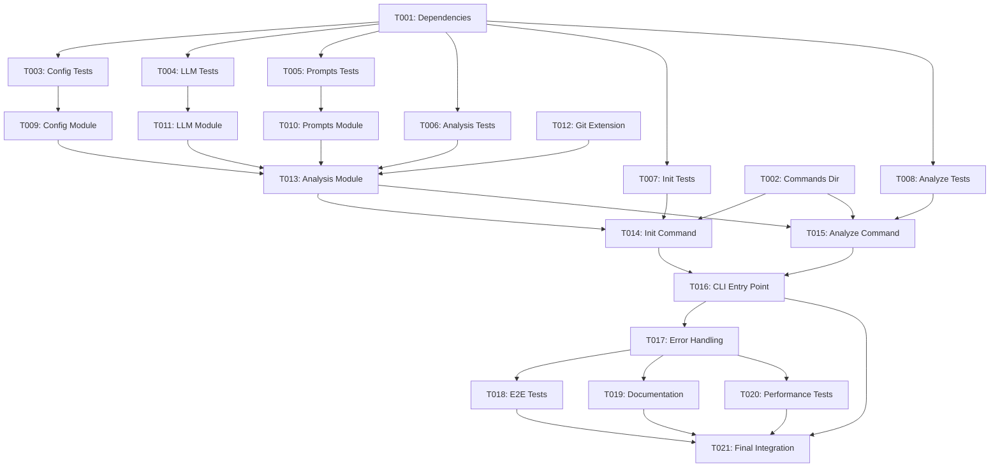

# Tasks: LLM-Powered Analysis

**Feature Branch**: `003-llm-powered-analysis`  
**Input**: Design documents from `/specs/003-llm-powered-analysis/`  
**Prerequisites**: ✅ plan.md, ✅ research.md, ✅ data-model.md, ✅ contracts/, ✅ quickstart.md

## Execution Flow (main)
```
1. Load plan.md from feature directory
   → ✅ Loaded: TypeScript CLI tool with OpenAI SDK, js-yaml, yup, commander
   → ✅ Tech stack: Node.js 20+, TypeScript 5.0+, Jest testing
   → ✅ Structure: CLI package with core modules, commands directory
2. Load optional design documents
   → ✅ data-model.md: AnalysisConfig, AnalysisRequest, AnalysisResult, AnalysisError entities
   → ✅ contracts/: config-manager.ts, llm-client.ts contracts
   → ✅ research.md: OpenAI SDK, js-yaml, yup, git diff patterns
   → ✅ quickstart.md: Integration test scenarios extracted
3. Generate tasks by category
   → Setup: Dependencies, project structure
   → Tests: Contract tests, unit tests, integration tests
   → Core: Config, LLM, prompts, analysis modules
   → Integration: CLI commands, git diff, error handling
   → Polish: E2E tests, documentation
4. Apply task rules
   → Different files marked [P] for parallel execution
   → Tests before implementation (TDD compliance)
   → Dependencies documented
5. Number tasks sequentially (T001-T025)
6. Generate dependency graph
7. ✅ Tasks ready for execution
```

---

## Format: `[ID] [P?] Description`
- **[P]**: Can run in parallel (different files, no dependencies)
- File paths are absolute from repository root: `/Users/rbarabash/Workspace/cADR/`

---

## Phase 3.1: Setup & Dependencies (Estimated: 30 minutes)

### T001: Add LLM Dependencies to CLI Package
**Priority**: CRITICAL - Blocks all other tasks  
**Files**: `/Users/rbarabash/Workspace/cADR/packages/cli/package.json`

Add required dependencies for LLM integration:

```json
{
  "dependencies": {
    "openai": "^4.0.0",
    "js-yaml": "^4.1.0",
    "yup": "^1.0.0",
    "commander": "^11.0.0"
  }
}
```

**DoD**:
- [ ] All 4 dependencies added to package.json
- [ ] Version constraints match research.md recommendations
- [ ] Run `npm install` to verify dependencies resolve

---

### T002: Create Commands Directory Structure
**Priority**: HIGH - Required for CLI commands  
**Files**: `/Users/rbarabash/Workspace/cADR/packages/cli/src/commands/`

Create directory structure for CLI commands:
```bash
mkdir -p packages/cli/src/commands
```

**DoD**:
- [ ] Commands directory created
- [ ] Ready for init.ts and analyze.ts files

---

## Phase 3.2: Tests First (TDD) ⚠️ MUST COMPLETE BEFORE 3.3
**CRITICAL: These tests MUST be written and MUST FAIL before ANY implementation**

### T003: [P] Unit Test - Configuration Module
**Priority**: HIGH - TDD requirement  
**Files**: `/Users/rbarabash/Workspace/cADR/packages/cli/src/config.test.ts`

Create unit test for YAML configuration management:

```typescript
import { loadConfig, createConfig, validateConfig } from './config';

describe('Configuration Module', () => {
  test('loads valid YAML configuration', async () => {
    // Mock file system, test YAML parsing
  });

  test('validates configuration schema', () => {
    // Test yup validation rules
  });

  test('handles invalid YAML gracefully', async () => {
    // Test error scenarios
  });

  test('creates config interactively', async () => {
    // Mock prompts, test config creation
  });
});
```

**Expected**: ❌ Tests MUST fail (config module doesn't exist yet)

**DoD**:
- [ ] Test file created with 4 test cases
- [ ] Tests fail when run (RED state)
- [ ] Covers YAML parsing, validation, error handling

---

### T004: [P] Unit Test - LLM Client Module
**Priority**: HIGH - TDD requirement  
**Files**: `/Users/rbarabash/Workspace/cADR/packages/cli/src/llm.test.ts`

Create unit test for OpenAI integration:

```typescript
import { analyzeChanges } from './llm';

// Mock OpenAI client
jest.mock('openai');

describe('LLM Client Module', () => {
  test('analyzes changes successfully', async () => {
    // Mock successful OpenAI response
  });

  test('handles API failures gracefully', async () => {
    // Mock API error, test fail-open behavior
  });

  test('handles rate limiting', async () => {
    // Mock rate limit error
  });

  test('validates response format', async () => {
    // Test JSON parsing and validation
  });
});
```

**Expected**: ❌ Tests MUST fail (LLM module doesn't exist yet)

**DoD**:
- [ ] Test file created with 4 test cases
- [ ] OpenAI client properly mocked
- [ ] Tests fail when run (RED state)

---

### T005: [P] Unit Test - Prompts Module
**Priority**: MEDIUM - TDD requirement  
**Files**: `/Users/rbarabash/Workspace/cADR/packages/cli/src/prompts.test.ts`

Create unit test for prompt templates:

```typescript
import { ANALYSIS_PROMPT_V1 } from './prompts';

describe('Prompts Module', () => {
  test('prompt template includes required placeholders', () => {
    // Test {file_paths}, {diff_content} placeholders
  });

  test('prompt generates valid format', () => {
    // Test prompt formatting with sample data
  });
});
```

**Expected**: ❌ Tests MUST fail (prompts module doesn't exist yet)

**DoD**:
- [ ] Test file created with 2 test cases
- [ ] Tests fail when run (RED state)

---

### T006: [P] Unit Test - Analysis Orchestration
**Priority**: HIGH - TDD requirement  
**Files**: `/Users/rbarabash/Workspace/cADR/packages/cli/src/analysis.test.ts`

Create unit test for analysis orchestration:

```typescript
import { runAnalysis } from './analysis';

describe('Analysis Orchestration', () => {
  test('runs complete analysis flow', async () => {
    // Mock all dependencies, test full flow
  });

  test('handles missing configuration', async () => {
    // Test error scenarios
  });

  test('handles no staged files', async () => {
    // Test empty staged files scenario
  });
});
```

**Expected**: ❌ Tests MUST fail (analysis module doesn't exist yet)

**DoD**:
- [ ] Test file created with 3 test cases
- [ ] Tests fail when run (RED state)

---

### T007: [P] Integration Test - CLI Commands
**Priority**: HIGH - TDD requirement  
**Files**: `/Users/rbarabash/Workspace/cADR/packages/cli/src/commands/init.test.ts`

Create integration test for init command:

```typescript
import { initCommand } from './init';

describe('Init Command', () => {
  test('creates valid cadr.yaml', async () => {
    // Mock prompts, test YAML creation
  });

  test('handles file creation errors', async () => {
    // Test error scenarios
  });
});
```

**Expected**: ❌ Tests MUST fail (init command doesn't exist yet)

**DoD**:
- [ ] Test file created with 2 test cases
- [ ] Tests fail when run (RED state)

---

### T008: [P] Integration Test - Analyze Command
**Priority**: HIGH - TDD requirement  
**Files**: `/Users/rbarabash/Workspace/cADR/packages/cli/src/commands/analyze.test.ts`

Create integration test for analyze command:

```typescript
import { analyzeCommand } from './analyze';

describe('Analyze Command', () => {
  test('analyzes staged changes successfully', async () => {
    // Mock all dependencies, test full flow
  });

  test('handles analysis errors gracefully', async () => {
    // Test fail-open behavior
  });
});
```

**Expected**: ❌ Tests MUST fail (analyze command doesn't exist yet)

**DoD**:
- [ ] Test file created with 2 test cases
- [ ] Tests fail when run (RED state)

---

### ⚠️ CHECKPOINT: Verify Tests Fail
Before proceeding to Phase 3.3, run:
```bash
npm install
npm test
```
**Expected**: All tests fail (RED state) ✅ This is correct!

---

## Phase 3.3: Core Implementation (ONLY after tests are failing)

### T009: [P] Create Configuration Module
**Priority**: HIGH - Foundation module  
**Files**: `/Users/rbarabash/Workspace/cADR/packages/cli/src/config.ts`

Implement YAML configuration management:

```typescript
import * as yaml from 'js-yaml';
import * as yup from 'yup';
import { readFileSync, writeFileSync, existsSync } from 'fs';

export interface AnalysisConfig {
  provider: "openai";
  analysis_model: string;
  api_key_env: string;
  timeout_seconds: number;
  ignore_patterns?: string[];
}

const configSchema = yup.object({
  provider: yup.string().oneOf(['openai']).required(),
  analysis_model: yup.string().required(),
  api_key_env: yup.string().required(),
  timeout_seconds: yup.number().min(1).max(60).required(),
  ignore_patterns: yup.array().of(yup.string()).optional()
});

export async function loadConfig(configPath: string): Promise<AnalysisConfig | null>
export async function createConfig(configPath: string): Promise<AnalysisConfig | null>
export function validateConfig(config: any): {valid: boolean, errors: string[]}
```

**DoD**:
- [ ] All functions implemented
- [ ] YAML parsing with js-yaml
- [ ] Validation with yup schema
- [ ] Unit tests (T003) now PASS (GREEN state)

---

### T010: [P] Create Prompts Module
**Priority**: HIGH - LLM prompt templates  
**Files**: `/Users/rbarabash/Workspace/cADR/packages/cli/src/prompts.ts`

Implement versioned prompt templates:

```typescript
export const ANALYSIS_PROMPT_V1 = `
You are analyzing code changes for architectural significance.

Given the following staged changes:
{file_paths}

Diff content:
{diff_content}

Determine if these changes are architecturally significant.
Consider: new patterns, data model changes, API changes, security implications.

Respond ONLY with valid JSON:
{"is_significant": boolean, "reason": "explanation"}
`;

export function formatPrompt(template: string, data: {file_paths: string[], diff_content: string}): string
```

**DoD**:
- [ ] ANALYSIS_PROMPT_V1 exported
- [ ] formatPrompt function implemented
- [ ] Unit tests (T005) now PASS (GREEN state)

---

### T011: [P] Create LLM Client Module
**Priority**: HIGH - OpenAI integration  
**Files**: `/Users/rbarabash/Workspace/cADR/packages/cli/src/llm.ts`

Implement OpenAI client wrapper:

```typescript
import OpenAI from 'openai';
import { AnalysisConfig } from './config';

export interface AnalysisRequest {
  file_paths: string[];
  diff_content: string;
  repository_context: string;
  analysis_prompt: string;
}

export interface AnalysisResult {
  is_significant: boolean;
  reason: string;
  timestamp: string;
}

export async function analyzeChanges(
  config: AnalysisConfig,
  request: AnalysisRequest
): Promise<AnalysisResult | null> {
  // Initialize OpenAI client
  // Call ChatCompletion API with timeout
  // Parse JSON response
  // Handle errors (fail-open: return null, log warning)
}
```

**DoD**:
- [ ] OpenAI client integration
- [ ] Timeout handling (15s default)
- [ ] JSON response parsing
- [ ] Error handling (fail-open)
- [ ] Unit tests (T004) now PASS (GREEN state)

---

### T012: Extend Git Module
**Priority**: HIGH - Git diff functionality  
**Files**: `/Users/rbarabash/Workspace/cADR/packages/cli/src/git.ts`

Add staged diff functionality to existing git module:

```typescript
export async function getStagedDiff(): Promise<string> {
  // Execute: git diff --cached
  // Return full diff content
  // Handle errors with GitError
}
```

**DoD**:
- [ ] getStagedDiff() function added
- [ ] Uses existing GitError handling
- [ ] Returns full diff content
- [ ] Maintains existing functionality

---

### T013: [P] Create Analysis Orchestration Module
**Priority**: HIGH - Core business logic  
**Files**: `/Users/rbarabash/Workspace/cADR/packages/cli/src/analysis.ts`

Implement analysis orchestration:

```typescript
import { loadConfig } from './config';
import { analyzeChanges } from './llm';
import { getStagedFiles, getStagedDiff } from './git';
import { formatPrompt, ANALYSIS_PROMPT_V1 } from './prompts';

export async function runAnalysis(): Promise<void> {
  // 1. Load config from cadr.yaml
  // 2. Get staged files and diff
  // 3. Format prompt with data
  // 4. Call LLM for analysis
  // 5. Display results with formatting
  // 6. Always exit 0 (fail-open)
}
```

**DoD**:
- [ ] Complete orchestration logic
- [ ] Error handling (fail-open)
- [ ] Result formatting
- [ ] Unit tests (T006) now PASS (GREEN state)

---

### ✅ CHECKPOINT: Verify Tests Pass
Run tests again:
```bash
npm test
```
**Expected**: All tests PASS (GREEN state) ✅

---

## Phase 3.4: CLI Commands Implementation

### T014: [P] Create Init Command
**Priority**: HIGH - Interactive configuration  
**Files**: `/Users/rbarabash/Workspace/cADR/packages/cli/src/commands/init.ts`

Implement interactive configuration creation:

```typescript
import { createConfig } from '../config';
import * as readline from 'readline';

export async function initCommand(): Promise<void> {
  // Interactive prompts for:
  // - Provider (default: openai)
  // - Model (default: gpt-4)
  // - API key env var (default: OPENAI_API_KEY)
  // - Timeout (default: 15)
  // - Ignore patterns (optional)
  
  // Create cadr.yaml with validated config
  // Display success message
}
```

**DoD**:
- [ ] Interactive prompts implemented
- [ ] Config validation
- [ ] YAML file creation
- [ ] Success message display
- [ ] Integration tests (T007) now PASS (GREEN state)

---

### T015: [P] Create Analyze Command
**Priority**: HIGH - Analysis functionality  
**Files**: `/Users/rbarabash/Workspace/cADR/packages/cli/src/commands/analyze.ts`

Implement analysis command handler:

```typescript
import { runAnalysis } from '../analysis';

export async function analyzeCommand(): Promise<void> {
  // Call runAnalysis()
  // Handle any remaining error scenarios
  // Always exit 0 (fail-open)
}
```

**DoD**:
- [ ] Command handler implemented
- [ ] Calls runAnalysis()
- [ ] Fail-open error handling
- [ ] Integration tests (T008) now PASS (GREEN state)

---

### T016: Update CLI Entry Point
**Priority**: HIGH - Command routing  
**Files**: `/Users/rbarabash/Workspace/cADR/packages/cli/src/index.ts`

Add command routing with commander:

```typescript
import { program } from 'commander';
import { initCommand } from './commands/init';
import { analyzeCommand } from './commands/analyze';

program
  .name('cadr')
  .description('Continuous Architectural Decision Records')
  .version('0.0.1');

program
  .command('init')
  .description('Initialize cadr configuration')
  .action(initCommand);

program
  .option('--analyze', 'Analyze staged changes for architectural significance')
  .action((options) => {
    if (options.analyze) {
      analyzeCommand();
    } else {
      // Default: show welcome + staged files (existing behavior)
      displayWelcome();
      processStagedFiles();
    }
  });

program.parse();
```

**DoD**:
- [ ] Commander integration
- [ ] Init command routing
- [ ] Analyze flag handling
- [ ] Preserve existing welcome message functionality

---

## Phase 3.5: Error Handling & Polish

### T017: Implement Comprehensive Error Handling
**Priority**: HIGH - Fail-open principle  
**Files**: Multiple files

Ensure all error scenarios follow fail-open principle:

**Error Scenarios**:
- Missing API key: Display helpful message, exit 0
- Invalid config: Display validation errors, exit 0
- API failure: Log warning, display error, exit 0
- Rate limit: Display rate limit message, exit 0
- No staged files: Display info message, exit 0

**DoD**:
- [ ] All error scenarios handled
- [ ] Always exit with code 0
- [ ] Helpful error messages
- [ ] Structured logging for debugging

---

### T018: [P] Create E2E Tests
**Priority**: MEDIUM - End-to-end validation  
**Files**: `/Users/rbarabash/Workspace/cADR/tests/e2e/llm-analysis.test.ts`

Create end-to-end tests for complete workflow:

```typescript
describe('LLM Analysis E2E', () => {
  test('complete analysis workflow', async () => {
    // Test: cadr init → cadr --analyze
    // Mock OpenAI API
    // Verify complete flow
  });

  test('error scenarios', async () => {
    // Test various error conditions
    // Verify fail-open behavior
  });
});
```

**DoD**:
- [ ] E2E test file created
- [ ] Complete workflow tested
- [ ] Error scenarios covered
- [ ] All tests pass

---

### T019: [P] Update Documentation
**Priority**: MEDIUM - User guidance  
**Files**: `/Users/rbarabash/Workspace/cADR/README.md`

Update README with LLM analysis documentation:

```markdown
## LLM-Powered Analysis

### Setup
1. Install cADR: `npm install -g @yotpoltd/cadr-cli`
2. Set API key: `export OPENAI_API_KEY="your-key"`
3. Initialize: `cadr init`
4. Analyze: `cadr --analyze`

### Configuration
Edit `cadr.yaml` to customize:
- Model (gpt-4, gpt-3.5-turbo)
- Timeout settings
- Ignore patterns
```

**DoD**:
- [ ] README updated with LLM analysis section
- [ ] Setup instructions clear
- [ ] Configuration options documented
- [ ] Examples provided

---

### T020: [P] Performance Testing
**Priority**: LOW - Performance validation  
**Files**: `/Users/rbarabash/Workspace/cADR/tests/performance/analysis.test.ts`

Create performance tests:

```typescript
describe('Analysis Performance', () => {
  test('config loading < 2 seconds', async () => {
    // Test config loading performance
  });

  test('git operations < 1 second', async () => {
    // Test git diff performance
  });

  test('LLM timeout handling', async () => {
    // Test 15s timeout behavior
  });
});
```

**DoD**:
- [ ] Performance test file created
- [ ] All performance requirements tested
- [ ] Tests pass within time limits

---

### T021: Final Integration Testing
**Priority**: HIGH - Pre-completion validation  
**Files**: Multiple

Run complete integration test:

```bash
# 1. Build and test
npm run build
npm test

# 2. Test CLI commands
cadr init
cadr --analyze

# 3. Verify error handling
unset OPENAI_API_KEY
cadr --analyze  # Should exit 0 with helpful message
```

**DoD**:
- [ ] All tests pass
- [ ] CLI commands work correctly
- [ ] Error handling verified
- [ ] Performance requirements met
- [ ] Constitution compliance verified

---

## Dependencies Graph



---

## Parallel Execution Examples

### Setup Phase (can run together)
```bash
# After T001 and T002 complete, run in parallel:
Task: "[T003] Unit Test - Configuration Module"
Task: "[T004] Unit Test - LLM Client Module"  
Task: "[T005] Unit Test - Prompts Module"
Task: "[T006] Unit Test - Analysis Orchestration"
Task: "[T007] Integration Test - CLI Commands"
Task: "[T008] Integration Test - Analyze Command"
```

### Core Implementation Phase (can run together)
```bash
# After all tests are failing, run in parallel:
Task: "[T009] Create Configuration Module"
Task: "[T010] Create Prompts Module"
Task: "[T011] Create LLM Client Module"
Task: "[T013] Create Analysis Orchestration Module"
```

### Commands Phase (can run together)
```bash
Task: "[T014] Create Init Command"
Task: "[T015] Create Analyze Command"
```

### Polish Phase (can run together)
```bash
Task: "[T018] Create E2E Tests"
Task: "[T019] Update Documentation"
Task: "[T020] Performance Testing"
```

---

## Validation Checklist
*GATE: Must pass before considering feature complete*

- [x] All contracts have corresponding tests - ✅ T003, T004, T007, T008
- [x] All entities have model tasks - ✅ T009 (AnalysisConfig), T011 (AnalysisResult)
- [x] All tests come before implementation - ✅ T003-T008 before T009-T016
- [x] Parallel tasks truly independent - ✅ Verified
- [x] Each task specifies exact file path - ✅ All paths absolute
- [x] No task modifies same file as another [P] task - ✅ Verified

---

## Estimated Timeline

| Phase | Tasks | Estimated Time | Can Parallelize |
|-------|-------|----------------|-----------------|
| 3.1 Setup | T001-T002 | 30 minutes | T001-T002 |
| 3.2 Tests | T003-T008 | 2 hours | All |
| 3.3 Implementation | T009-T016 | 4-6 hours | T009-T011, T014-T015 |
| 3.4 Commands | T014-T016 | 2 hours | T014-T015 |
| 3.5 Polish | T017-T021 | 2-3 hours | T018-T020 |
| **Total** | **21 tasks** | **10-13 hours** | |

---

## Notes

- **[P] markers**: Different files = parallel safe
- **TDD Critical**: Tests (T003-T008) MUST fail before implementation starts
- **Fail-Open**: All error scenarios must exit with code 0
- **Constitution compliance**: Library-first, structured logging, versioned prompts
- **Coverage gate**: Must maintain ≥ 80% throughout

---

## Next Steps After Completion

1. ✅ Verify all 21 tasks completed
2. ✅ Run quickstart.md validation
3. ✅ Commit all changes
4. 📝 Test with real OpenAI API key
5. 🎉 Feature ready for production use

---

**Status**: ✅ Ready for Execution  
**Total Tasks**: 21  
**Estimated Completion**: 10-13 hours  
**Constitution Compliant**: ✅ Yes  
**Last Updated**: 2025-10-08
