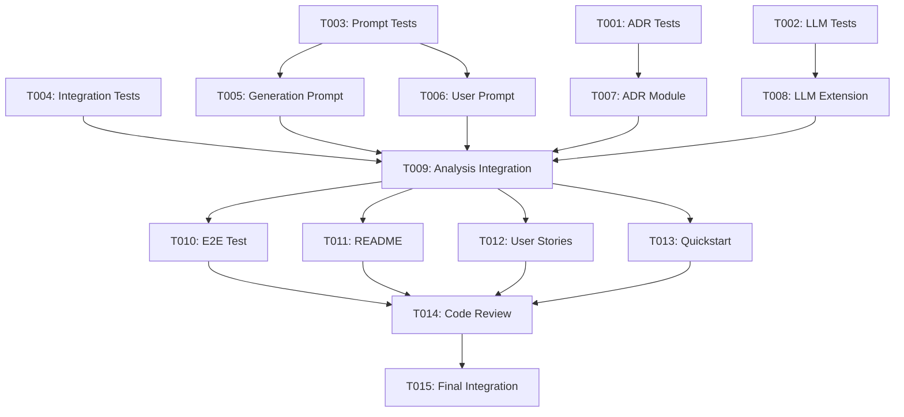

# Tasks: ADR Generation

**Feature Branch**: `004-adr-generation`  
**Input**: Design documents from `/specs/004-adr-generation/`  
**Prerequisites**: ✅ plan.md, ✅ research.md, ✅ data-model.md, ✅ contracts/, ✅ quickstart.md

## Execution Flow

```
1. Load plan.md from feature directory
   → ✅ Loaded: ADR generation with MADR format, user prompts, file management
   → ✅ Tech stack: TypeScript, existing Node.js fs/path, readline
   → ✅ Structure: Extend CLI package with adr.ts, extend llm.ts and prompts.ts
2. Load optional design documents
   → ✅ data-model.md: GenerationRequest, GenerationResult, ADRFile entities
   → ✅ contracts/: adr-manager.ts, llm-generation.ts, generation-prompts.ts
   → ✅ research.md: MADR format, slug generation, sequential numbering
   → ✅ quickstart.md: Integration test scenarios extracted
3. Generate tasks by category
   → Tests: Contract tests, unit tests (TDD)
   → Core: Prompts, ADR module, LLM extension
   → Integration: Analysis workflow integration
   → Polish: Documentation, E2E tests
4. Apply task rules
   → Different files marked [P] for parallel execution
   → Tests before implementation (TDD compliance)
   → Dependencies documented
5. Number tasks sequentially (T001-T015)
6. ✅ Tasks ready for execution
```

---

## Format: `[ID] [P?] Description`

- **[P]**: Can run in parallel (different files, no dependencies)
- File paths are absolute from repository root: `/Users/rbarabash/Workspace/cADR/`

---

## Phase 1: Tests First (TDD) ⚠️ MUST COMPLETE BEFORE PHASE 2

**CRITICAL: These tests MUST be written and MUST FAIL before ANY implementation**

### T001: [P] Unit Test - ADR File Management Module

**Priority**: HIGH - TDD requirement  
**Files**: `/Users/rbarabash/Workspace/cADR/packages/cli/src/adr.test.ts`

Create comprehensive unit tests for ADR file management:

```typescript
import {
  titleToSlug,
  getNextADRNumber,
  generateADRFilename,
  ensureADRDirectory,
  saveADR,
} from './adr';

describe('ADR Module', () => {
  describe('titleToSlug', () => {
    test('converts title to lowercase slug');
    test('replaces spaces with hyphens');
    test('handles special characters');
    test('removes leading/trailing hyphens');
  });

  describe('getNextADRNumber', () => {
    test('returns 1 for non-existent directory');
    test('returns 1 for empty directory');
    test('returns next number after existing ADRs');
    test('handles non-sequential numbers');
  });

  describe('generateADRFilename', () => {
    test('generates properly formatted filename');
    test('pads numbers with zeros (4 digits)');
  });

  describe('ensureADRDirectory', () => {
    test('creates directory if not exists');
    test('creates nested directories');
    test('no error if directory already exists');
  });

  describe('saveADR', () => {
    test('saves ADR with correct filename');
    test('creates directory if needed');
    test('increments number for multiple ADRs');
    test('handles file write errors gracefully');
  });
});
```

**Expected**: ❌ All tests MUST fail (adr module doesn't exist yet)

**DoD**:

- [ ] Test file created with 15+ test cases
- [ ] Tests fail when run (RED state)
- [ ] Covers all functions in ADR contract
- [ ] Uses proper mocking for fs operations

---

### T002: [P] Unit Test - LLM Generation Extension

**Priority**: HIGH - TDD requirement  
**Files**: `/Users/rbarabash/Workspace/cADR/packages/cli/src/llm.test.ts` (extend existing)

Add tests for ADR generation function:

```typescript
import { generateADRContent } from './llm';

describe('LLM Generation', () => {
  test('generates ADR content successfully');
  test('extracts title from markdown');
  test('handles API failures gracefully');
  test('handles invalid markdown response');
  test('respects timeout configuration');
  test('follows fail-open on errors');
});
```

**Expected**: ❌ Tests MUST fail (generateADRContent doesn't exist yet)

**DoD**:

- [ ] 6+ test cases added to existing llm.test.ts
- [ ] Tests fail when run (RED state)
- [ ] Covers GenerationRequest, GenerationResult, GenerationResponse
- [ ] Mocks OpenAI API responses

---

### T003: [P] Unit Test - Generation Prompts Extension

**Priority**: HIGH - TDD requirement  
**Files**: `/Users/rbarabash/Workspace/cADR/packages/cli/src/prompts.test.ts` (extend existing)

Add tests for generation prompt and user confirmation:

```typescript
import {
  GENERATION_PROMPT_V1,
  formatGenerationPrompt,
  promptForGeneration,
} from './prompts';

describe('Generation Prompts', () => {
  describe('GENERATION_PROMPT_V1', () => {
    test('contains MADR template structure');
    test('includes required placeholders');
  });

  describe('formatGenerationPrompt', () => {
    test('replaces file_paths placeholder');
    test('replaces diff_content placeholder');
    test('replaces current_date placeholder');
  });

  describe('promptForGeneration', () => {
    test('returns true for empty input (ENTER)');
    test('returns true for "yes" input');
    test('returns true for "y" input');
    test('returns false for "no" input');
    test('returns false for "n" input');
    test('returns false for other input');
  });
});
```

**Expected**: ❌ Tests MUST fail (functions don't exist yet)

**DoD**:

- [ ] 9+ test cases added to existing prompts.test.ts
- [ ] Tests fail when run (RED state)
- [ ] Covers generation prompt and user interaction
- [ ] Mocks readline for user prompt tests

---

### T004: [P] Integration Test - Analysis with Generation

**Priority**: HIGH - TDD requirement  
**Files**: `/Users/rbarabash/Workspace/cADR/packages/cli/src/analysis.test.ts` (extend existing)

Add integration tests for generation flow:

```typescript
import { runAnalysis } from './analysis';

describe('Analysis with Generation', () => {
  test('prompts for generation when significant');
  test('generates ADR when user confirms');
  test('skips generation when user declines');
  test('handles generation errors gracefully');
  test('displays success message with filepath');
});
```

**Expected**: ❌ Tests MUST fail (generation integration doesn't exist yet)

**DoD**:

- [ ] 5+ test cases added
- [ ] Tests fail when run (RED state)
- [ ] Mocks all dependencies (LLM, fs, readline)
- [ ] Tests complete workflow

---

### ⚠️ CHECKPOINT: Verify Tests Fail

Before proceeding to Phase 2, run:

```bash
cd /Users/rbarabash/Workspace/cADR
npm test
```

**Expected**: New tests fail (RED state) ✅ This is correct!

---

## Phase 2: Core Implementation (ONLY after tests are failing)

### T005: [P] Create Generation Prompt Template

**Priority**: HIGH - Foundation for generation  
**Files**: `/Users/rbarabash/Workspace/cADR/packages/cli/src/prompts.ts`

Add GENERATION_PROMPT_V1 and formatting function:

```typescript
export const GENERATION_PROMPT_V1 = `
You are an expert software architect...
[Full MADR template with instructions]
...
`;

export function formatGenerationPrompt(data: {
  file_paths: string[];
  diff_content: string;
}): string {
  // Replace placeholders
  // Add current date
  // Return formatted prompt
}
```

**DoD**:

- [ ] GENERATION_PROMPT_V1 constant created with full MADR template
- [ ] formatGenerationPrompt() function implemented
- [ ] Replaces {file_paths}, {diff_content}, {current_date}
- [ ] Unit tests (T003) now PASS (GREEN state)

---

### T006: [P] Create User Confirmation Prompt

**Priority**: HIGH - User interaction  
**Files**: `/Users/rbarabash/Workspace/cADR/packages/cli/src/prompts.ts`

Add user confirmation function:

```typescript
import * as readline from 'readline';

export async function promptForGeneration(reason: string): Promise<boolean> {
  return new Promise((resolve) => {
    const rl = readline.createInterface({
      input: process.stdin,
      output: process.stdout,
    });

    console.log(`\n💭 ${reason}\n`);
    
    rl.question('📝 Would you like to generate an ADR? (Press ENTER or type "yes" to confirm, "no" to skip): ', (answer) => {
      rl.close();
      const normalized = answer.trim().toLowerCase();
      const confirmed = normalized === '' || normalized === 'y' || normalized === 'yes';
      resolve(confirmed);
    });
  });
}
```

**DoD**:

- [ ] promptForGeneration() function implemented
- [ ] Uses readline for user input
- [ ] Accepts ENTER, "yes", "y" as confirmation
- [ ] Unit tests (T003) now PASS (GREEN state)

---

### T007: [P] Create ADR File Management Module

**Priority**: HIGH - Core functionality  
**Files**: `/Users/rbarabash/Workspace/cADR/packages/cli/src/adr.ts`

Create new ADR module with all file management functions:

```typescript
import * as fs from 'fs';
import * as path from 'path';
import { loggerInstance as logger } from './logger';

export const DEFAULT_ADR_DIR = 'docs/adr';

export function titleToSlug(title: string): string {
  // Convert to lowercase, replace non-alphanumeric with hyphens
}

export function getNextADRNumber(adrDir: string): number {
  // Scan directory, find max number, return max + 1
}

export function ensureADRDirectory(adrDir: string): void {
  // Create directory recursively if needed
}

export function generateADRFilename(number: number, title: string): string {
  // Format: NNNN-slug.md
}

export function saveADR(
  content: string,
  title: string,
  adrDir: string = DEFAULT_ADR_DIR
): { success: boolean; filePath?: string; error?: string } {
  // Orchestrator: ensure dir, get number, generate filename, write file
}
```

**DoD**:

- [ ] All 5 functions implemented
- [ ] Proper error handling with try-catch
- [ ] Structured logging for key events
- [ ] Unit tests (T001) now PASS (GREEN state)

---

### T008: [P] Extend LLM Module with Generation

**Priority**: HIGH - Core functionality  
**Files**: `/Users/rbarabash/Workspace/cADR/packages/cli/src/llm.ts`

Add generation interfaces and function:

```typescript
export interface GenerationRequest {
  file_paths: string[];
  diff_content: string;
  reason: string;
  generation_prompt: string;
}

export interface GenerationResult {
  content: string;
  title: string;
  timestamp: string;
}

export interface GenerationResponse {
  result: GenerationResult | null;
  error?: string;
}

export async function generateADRContent(
  config: AnalysisConfig,
  request: GenerationRequest
): Promise<GenerationResponse> {
  try {
    // Check API key
    // Call OpenAI API (use existing provider)
    // Parse response
    // Extract title from markdown
    // Return result
  } catch (error) {
    // Fail-open: log and return error
  }
}
```

**DoD**:

- [ ] All interfaces defined
- [ ] generateADRContent() function implemented
- [ ] Reuses existing provider pattern
- [ ] Title extraction via regex
- [ ] Fail-open error handling
- [ ] Unit tests (T002) now PASS (GREEN state)

---

### ✅ CHECKPOINT: Verify Core Tests Pass

Run tests again:

```bash
npm test
```

**Expected**: T001-T004 tests PASS (GREEN state) ✅

---

## Phase 3: Integration

### T009: Integrate Generation into Analysis Flow

**Priority**: CRITICAL - Connects everything  
**Files**: `/Users/rbarabash/Workspace/cADR/packages/cli/src/analysis.ts`

Modify the analysis workflow to include generation:

**Location**: After displaying "ARCHITECTURALLY SIGNIFICANT" result (around line 160)

**Changes**:

```typescript
// Add imports
import { formatGenerationPrompt, GENERATION_PROMPT_V1, promptForGeneration } from './prompts';
import { generateADRContent } from './llm';
import { saveADR } from './adr';

// Replace the existing "if (result.is_significant)" block with:
if (result.is_significant) {
  console.log('📊 Result: ✨ ARCHITECTURALLY SIGNIFICANT');
  console.log(`💭 Reasoning: ${result.reason}\n`);
  
  // NEW: Prompt user for generation
  const shouldGenerate = await promptForGeneration(result.reason);
  
  if (shouldGenerate) {
    console.log('\n🧠 Generating ADR draft...\n');
    
    // Format generation prompt
    const generationPrompt = formatGenerationPrompt({
      file_paths: changedFiles,
      diff_content: diffContent,
    });
    
    // Call LLM
    const generationResponse = await generateADRContent(config, {
      file_paths: changedFiles,
      diff_content: diffContent,
      reason: result.reason,
      generation_prompt: generationPrompt,
    });
    
    if (generationResponse.result) {
      // Save ADR
      const saveResult = saveADR(
        generationResponse.result.content,
        generationResponse.result.title
      );
      
      if (saveResult.success) {
        console.log('✅ Success! Draft ADR created\n');
        console.log(`📄 File: ${saveResult.filePath}\n`);
        console.log('💡 Next steps:');
        console.log('   1. Review and refine the generated ADR');
        console.log('   2. Commit it alongside your code changes\n');
      } else {
        console.error(`\n❌ Failed to save ADR: ${saveResult.error}\n`);
      }
    } else {
      console.error(`\n❌ ADR generation failed: ${generationResponse.error}\n`);
    }
  } else {
    console.log('\n📋 Skipping ADR generation');
    console.log('🎯 Recommendation: Consider documenting this decision manually.\n');
  }
}
```

**DoD**:

- [ ] Generation flow integrated after analysis
- [ ] User prompt displays reason
- [ ] Handles both confirmation and decline
- [ ] Error handling for generation failures
- [ ] Error handling for file save failures
- [ ] Success message with filepath
- [ ] Integration tests (T004) now PASS (GREEN state)

---

## Phase 4: Polish & Documentation

### T010: [P] Add E2E Test

**Priority**: MEDIUM - End-to-end validation  
**Files**: `/Users/rbarabash/Workspace/cADR/tests/integration/adr-generation.test.ts`

Create end-to-end test for complete flow:

```typescript
describe('ADR Generation E2E', () => {
  test('complete flow: analysis → prompt → generate → save');
  test('user declines generation');
  test('generation error handled gracefully');
  test('sequential numbering works');
  test('directory created automatically');
});
```

**DoD**:

- [ ] E2E test file created
- [ ] 5 test scenarios covered
- [ ] Mocks all external dependencies
- [ ] All tests pass

---

### T011: [P] Update README Documentation

**Priority**: MEDIUM - User guidance  
**Files**: `/Users/rbarabash/Workspace/cADR/README.md`

Add ADR generation documentation:

```markdown
## Generating ADRs

When cADR detects an architecturally significant change, it will prompt you to generate an ADR:

```bash
cadr analyze

# If significant change detected:
# 📝 Would you like to generate an ADR? (Press ENTER to confirm)
```

Press **ENTER** or type **"yes"** to generate. The ADR will be created in `docs/adr/` following the MADR template format.

### ADR Format

cADR generates ADRs using the [MADR template](https://adr.github.io/madr/):

- Context and Problem Statement
- Decision Drivers
- Considered Options
- Decision Outcome
- Consequences

### File Naming

ADRs are automatically numbered sequentially:

- `0001-first-decision.md`
- `0002-second-decision.md`
- etc.

```

**DoD**:
- [ ] README section added for ADR generation
- [ ] Includes examples and format info
- [ ] Clear instructions for users
- [ ] Links to MADR template

---

### T012: [P] Update USER_STORIES.md
**Priority**: LOW - Documentation consistency  
**Files**: `/Users/rbarabash/Workspace/cADR/docs/USER_STORIES.md`

Update Story #5 to mark as complete:

```markdown
### **Story \#5: The Payoff - Generation**

> **As Alex the developer**, after I confirm 'y' at the prompt, I want `cadr` to call an LLM with my code changes and use the response to create a new draft ADR file, **so that the primary value of the tool is delivered.**

* **Definition of Done:**
  * [x] User confirmation prompt implemented
  * [x] ADR generation using same LLM model
  * [x] MADR template format followed
  * [x] Automatic directory creation (docs/adr/)
  * [x] Sequential numbering (0001, 0002, ...)
  * [x] Success message with filepath displayed
  * [x] Fail-open principle maintained
  * [x] Complete end-to-end test coverage
```

**DoD**:

- [ ] Story #5 checkboxes updated
- [ ] Reflects actual implementation

---

### T013: Run Quickstart Validation

**Priority**: HIGH - Pre-completion validation  
**Files**: All

Execute all scenarios from quickstart.md:

```bash
# Scenario 1: Happy path
# Scenario 2: User declines
# Scenario 3: Sequential numbering
# Scenario 4: Error handling
# Scenario 5: Directory auto-creation
```

**DoD**:

- [ ] All quickstart scenarios pass
- [ ] Performance within expected ranges
- [ ] No unexpected errors or warnings
- [ ] Generated ADRs follow MADR format

---

### T014: Code Review & Cleanup

**Priority**: MEDIUM - Code quality  
**Files**: All modified files

Perform self-review:

**Checklist**:

- [ ] No console.log (use logger)
- [ ] All errors handled gracefully
- [ ] TypeScript types are strict
- [ ] No ESLint errors
- [ ] Code follows existing patterns
- [ ] Comments are clear and helpful
- [ ] No TODO or FIXME left in code

**DoD**:

- [ ] All files reviewed
- [ ] Code quality standards met
- [ ] No linter errors

---

### T015: Final Integration Test

**Priority**: CRITICAL - Completion gate  
**Files**: All

Complete validation before marking feature done:

```bash
# 1. Run all tests
npm test

# 2. Check coverage
npm run test:coverage
# Expected: ≥ 80% coverage

# 3. Build project
npm run build

# 4. Manual smoke test
export OPENAI_API_KEY="your-key"
cd /tmp/test-repo
git init
echo "test" > file.ts
git add file.ts
cadr analyze
# Confirm generation, verify ADR created

# 5. Verify file structure
ls docs/adr/
cat docs/adr/0001-*.md
```

**DoD**:

- [ ] All automated tests pass
- [ ] Coverage ≥ 80%
- [ ] Build succeeds
- [ ] Manual smoke test passes
- [ ] No regressions in existing features
- [ ] Ready for PR/merge

---

## Dependencies Graph



---

## Parallel Execution Strategy

### Phase 1 (Tests) - All parallel

```bash
Task: "[T001] Unit Test - ADR Module"
Task: "[T002] Unit Test - LLM Generation"
Task: "[T003] Unit Test - Generation Prompts"
Task: "[T004] Integration Test - Analysis"
```

### Phase 2 (Implementation) - All parallel

```bash
Task: "[T005] Generation Prompt Template"
Task: "[T006] User Confirmation Prompt"
Task: "[T007] ADR File Management"
Task: "[T008] LLM Generation Extension"
```

### Phase 3 (Integration) - Sequential

```bash
Task: "[T009] Integrate into Analysis"  # Must be after Phase 2
```

### Phase 4 (Polish) - Mostly parallel

```bash
Task: "[T010] E2E Test"  # Can run in parallel
Task: "[T011] README"    # Can run in parallel
Task: "[T012] User Stories"  # Can run in parallel
# Then:
Task: "[T013] Quickstart Validation"
Task: "[T014] Code Review"
Task: "[T015] Final Integration"
```

---

## Estimated Timeline

| Phase | Tasks | Estimated Time | Can Parallelize |
|-------|-------|----------------|-----------------|
| 1 Tests | T001-T004 | 2-3 hours | All |
| 2 Implementation | T005-T008 | 3-4 hours | All |
| 3 Integration | T009 | 1-2 hours | No |
| 4 Polish | T010-T015 | 2-3 hours | T010-T012 |
| **Total** | **15 tasks** | **8-12 hours** | |

---

## Validation Checklist

*GATE: Must pass before considering feature complete*

- [x] All contracts have corresponding tests - ✅ T001, T002, T003
- [x] All entities have implementation tasks - ✅ T007 (ADRFile), T008 (Generation)
- [x] All tests come before implementation - ✅ T001-T004 before T005-T009
- [x] Parallel tasks truly independent - ✅ Verified
- [x] Each task specifies exact file path - ✅ All paths absolute
- [x] No task modifies same file as another [P] task - ✅ Verified

---

## Success Criteria

Feature is complete when:

1. ✅ All 15 tasks completed
2. ✅ All tests pass (unit, integration, E2E)
3. ✅ Code coverage ≥ 80%
4. ✅ Quickstart scenarios all pass
5. ✅ No linter errors
6. ✅ Documentation updated
7. ✅ Manual smoke test passes
8. ✅ Fail-open principle maintained throughout

---

**Status**: ✅ Ready for Execution  
**Total Tasks**: 15  
**Estimated Completion**: 8-12 hours  
**Constitution Compliant**: ✅ Yes  
**Last Updated**: 2025-10-21
