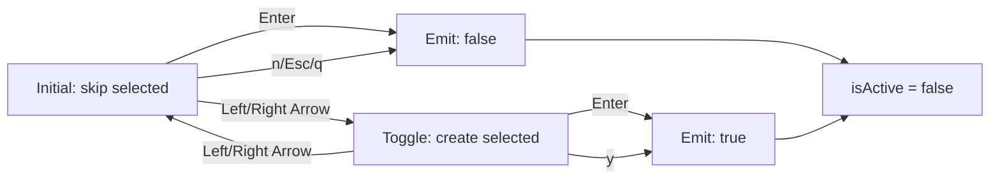

# Data Model: Interactive Prompt with Ink

**Feature**: Story #4 - Interactive Prompt  
**Date**: 2025-01-09  
**Status**: Complete

## Overview

This document defines the data structures and state management for the interactive Ink prompt feature. The prompt is a stateful UI component that manages user selection and emits a decision when the user confirms their choice.

---

## Entity Definitions

### 1. PromptState

**Purpose**: Internal state of the Ink prompt component

**Schema**:
```typescript
interface PromptState {
  selection: 'create' | 'skip';  // Currently selected option
  isActive: boolean;              // Prompt is mounted and awaiting input
  reason: string;                 // LLM analysis reason text to display
}
```

**Field Descriptions**:

| Field | Type | Required | Description | Validation |
|-------|------|----------|-------------|------------|
| `selection` | enum | Yes | Current user selection | Must be 'create' or 'skip' |
| `isActive` | boolean | Yes | Whether prompt is waiting for input | Set to false after user decision |
| `reason` | string | Yes | Reason from LLM analysis | Can be empty string (per ANALYSIS_PROMPT_V1) |

**Initial State**:
```typescript
const initialState: PromptState = {
  selection: 'skip',     // Default: safe, non-destructive option
  isActive: true,        // Prompt starts active
  reason: result.reason  // From LLM analysis result
};
```

**State Transitions**:



**Rules**:
- `selection` can only be 'create' or 'skip'
- `isActive` starts true, becomes false after any user decision
- `reason` is immutable after initial render
- Component unmounts when `isActive` becomes false

---

### 2. UserDecision

**Purpose**: Output of the prompt, indicating user's choice

**Schema**:
```typescript
interface UserDecision {
  createAdr: boolean;    // true = create ADR, false = skip
  timestamp: string;     // ISO 8601 timestamp of decision
}
```

**Field Descriptions**:

| Field | Type | Required | Description | Example |
|-------|------|----------|-------------|---------|
| `createAdr` | boolean | Yes | Whether user chose to create ADR | true, false |
| `timestamp` | string | Yes | When decision was made | "2025-01-09T10:30:00.000Z" |

**Usage**:
```typescript
const decision: UserDecision = {
  createAdr: selected === 'create',
  timestamp: new Date().toISOString()
};

logger.info('User decision recorded', decision);
```

**Lifecycle**:
1. User interacts with prompt
2. User confirms choice (Enter, y, n, Esc, q)
3. `UserDecision` created with current timestamp
4. Decision logged and returned to caller
5. Caller acts on `createAdr` boolean

---

### 3. TTYEnvironment

**Purpose**: Environment detection for determining if interactive prompt should be shown

**Schema**:
```typescript
interface TTYEnvironment {
  isTTY: boolean;             // process.stdout.isTTY
  isCI: boolean;              // process.env.CI === 'true'
  shouldShowPrompt: boolean;  // isTTY && !isCI
}
```

**Field Descriptions**:

| Field | Type | Description | Source |
|-------|------|-------------|--------|
| `isTTY` | boolean | Terminal supports interactive display | `process.stdout.isTTY` |
| `isCI` | boolean | Running in CI environment | `process.env.CI` |
| `shouldShowPrompt` | boolean | Derived: show Ink UI or text fallback | `isTTY && !isCI` |

**Decision Logic**:
```typescript
function detectTTY(): TTYEnvironment {
  const isTTY = process.stdout.isTTY ?? false;
  const isCI = process.env.CI === 'true' || process.env.CI === '1';
  const shouldShowPrompt = isTTY && !isCI;
  
  return { isTTY, isCI, shouldShowPrompt };
}
```

**Truth Table**:

| isTTY | isCI | shouldShowPrompt | Action |
|-------|------|------------------|--------|
| true  | false | true | Show Ink prompt |
| true  | true  | false | Text fallback (CI detected) |
| false | false | false | Text fallback (no TTY) |
| false | true  | false | Text fallback (no TTY + CI) |

---

## State Flow

### Component Lifecycle

```
1. MOUNT
   ├─ Initialize state: { selection: 'skip', isActive: true, reason: <LLM reason> }
   ├─ Render prompt with default selection
   └─ Register keyboard input handler

2. USER INTERACTION
   ├─ Arrow keys: Toggle selection between 'create' and 'skip'
   │  └─ Re-render with updated selection indicator
   ├─ Enter: Emit decision based on current selection
   │  └─ Set isActive = false
   └─ Direct shortcuts (y/n/Esc/q): Emit decision immediately
      └─ Set isActive = false

3. DECISION MADE
   ├─ Create UserDecision object with timestamp
   ├─ Log decision to stderr (structured logging)
   ├─ Call onSubmit callback with boolean
   └─ Unmount component

4. UNMOUNT
   ├─ Clean up keyboard input handler
   ├─ Restore terminal state
   └─ Return control to CLI
```

### Integration Flow

```
analysis.ts detects is_significant = true
  ↓
detectTTY() checks environment
  ↓
  ├─ shouldShowPrompt = true
  │   ↓
  │   import AnalysisPrompt
  │   ↓
  │   promptForAdr(reason) → Promise<boolean>
  │   ↓
  │   [User interacts with Ink UI]
  │   ↓
  │   Promise resolves with decision
  │   ↓
  │   if true: "Creating ADR..." (Story #5)
  │   if false: "Skipped ADR creation."
  │
  └─ shouldShowPrompt = false
      ↓
      Print text summary
      ↓
      "Tip: Run in interactive terminal..."
```

---

## Data Validation

### Input Validation (promptForAdr)

**Parameter**: `reason: string`
- **Required**: Yes
- **Validation**: None (LLM can return empty string)
- **Sanitization**: None (displayed as-is)
- **Max length**: No hard limit, but Ink will wrap/truncate in layout

### Output Validation (UserDecision)

**Field**: `createAdr: boolean`
- **Required**: Yes
- **Possible values**: true, false
- **Default**: N/A (user must decide)

**Field**: `timestamp: string`
- **Required**: Yes
- **Format**: ISO 8601 (YYYY-MM-DDTHH:mm:ss.sssZ)
- **Generation**: `new Date().toISOString()`

---

## Error Handling

### Ink Render Failure

**Scenario**: Ink fails to render (terminal incompatibility, corrupted output, etc.)

**Handling**:
```typescript
try {
  const decision = await promptForAdr(reason);
  return decision;
} catch (error) {
  logger.warn('Ink prompt failed to render, falling back to text', { error });
  console.log('📊 Result: ✨ ARCHITECTURALLY SIGNIFICANT');
  console.log(`💭 Reasoning: ${reason}\n`);
  return false; // Default to "skip" (safe)
}
```

**Result**: Fail-open principle maintained, user workflow not blocked

### User Force-Quit (Ctrl+C)

**Scenario**: User presses Ctrl+C while prompt is active

**Handling**: Ink's built-in `exitOnCtrlC: true` (default)
- Unmounts component cleanly
- Exits process with code 130 (standard for Ctrl+C)
- No custom handling needed

---

## Logging Events

### Prompt Lifecycle Events

**Format**: Structured JSON logs to stderr via pino

```typescript
// Prompt shown
logger.info('Interactive prompt displayed', {
  reason: result.reason,
  isTTY: env.isTTY,
  isCI: env.isCI
});

// User decision
logger.info('User decision recorded', {
  createAdr: decision,
  selection: selected,
  timestamp: new Date().toISOString()
});

// Prompt fallback
logger.info('Text fallback used (no TTY)', {
  reason: result.reason,
  isTTY: env.isTTY,
  isCI: env.isCI
});
```

---

## Performance Considerations

### Render Time
- **Target**: < 100ms from decision to display
- **Measurement**: Log timestamp before and after render
- **Optimization**: Minimal component tree, no heavy computation

### Memory
- **Component size**: Negligible (single stateful component)
- **Cleanup**: Unmount releases all resources
- **No leaks**: Keyboard handler deregistered on unmount

### Responsiveness
- **Input latency**: < 50ms from keypress to visual update
- **Ink handles**: Automatic diffing and minimal re-renders
- **Testing**: Verify with rapid key presses

---

## Accessibility

### Screen Reader Considerations

**Current Scope**: Basic visual UI only (Story #4)

**Future Enhancements** (out of scope):
- ARIA labels for screen readers
- Audio cues for selection changes
- Text-to-speech for reason text

**Mitigation**: Text fallback in non-TTY environments ensures basic accessibility

### Keyboard-Only Navigation

✅ **Fully supported**:
- All interactions via keyboard (no mouse required)
- Multiple input methods (arrows, shortcuts)
- Clear visual feedback for selection

---

## Testing Data

### Mock Data

**Test Reason (Short)**:
```typescript
const reason = "Introduces new database schema";
```

**Test Reason (Long)**:
```typescript
const reason = "This change introduces a new database schema for user authentication, " +
               "modifies the API contract for login endpoints, and adds a new " +
               "encryption library for password hashing.";
```

**Test Reason (Empty)**:
```typescript
const reason = ""; // Valid per ANALYSIS_PROMPT_V1 when is_significant=false
```

### Test Scenarios

1. **Default Selection**:
   - Initial state: `{ selection: 'skip', isActive: true, reason: "Test" }`
   - Expected: "▶ Skip" indicator visible

2. **Toggle Selection**:
   - Press right arrow
   - Expected: `{ selection: 'create' }`, "▶ Create ADR" visible

3. **Confirm Create**:
   - Set selection to 'create', press Enter
   - Expected: `onSubmit(true)`, `isActive = false`

4. **Confirm Skip**:
   - Default selection, press Enter
   - Expected: `onSubmit(false)`, `isActive = false`

5. **Direct Shortcut (y)**:
   - Press 'y' key
   - Expected: `onSubmit(true)` immediately

6. **Direct Shortcut (n)**:
   - Press 'n' key
   - Expected: `onSubmit(false)` immediately

---

## Summary

**Key Entities**:
- `PromptState`: Internal component state (selection, isActive, reason)
- `UserDecision`: Output object (createAdr, timestamp)
- `TTYEnvironment`: Environment detection (isTTY, isCI, shouldShowPrompt)

**State Transitions**:
- Arrow keys toggle selection
- Enter/shortcuts emit decision
- Decision triggers unmount

**Validation**:
- No input validation needed (reason is arbitrary string)
- Output is boolean + timestamp (always valid)

**Error Handling**:
- Ink render failure → text fallback
- Ctrl+C → clean exit via Ink
- Fail-open principle maintained

**Ready for Contracts** ✅

---

_Data model complete: 2025-01-09_

